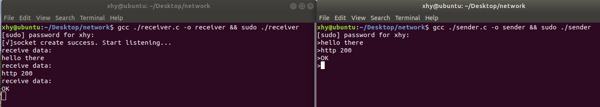
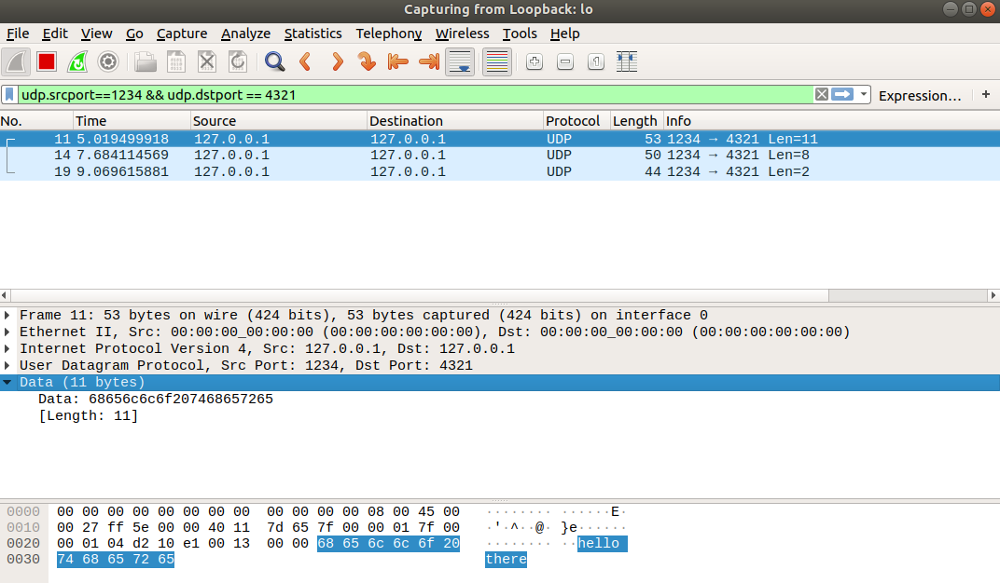
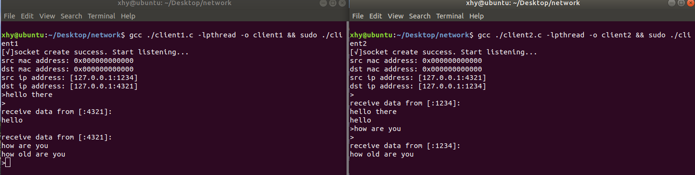

# 计网Project
## Tunnel
### 组件
逻辑组件分为`sender`, `packer`, `unpacker`, `receiver`四个部分。
### 实现
与逻辑组件一致，分为四个部分。

`sender`发送普通IP报文至`packer`。

`packer`解析出净载荷后，打包成IP in IP报文，发送至`unpacker`。

`unpacker`解包IP in IP报文后，转发至`receiver`。

`receiver`接收普通IP报文。
### 编译运行
测试环境：`Ubuntu 21.04`, `CentOS 7.6`, `openEuler 20.03` (gcc 7+)
```
gcc sender.c -lpthread -o sender && sudo ./sender
gcc packer.c -lpthread -o packer && sudo ./packer
gcc unpacker.c -lpthread -o unpacker && sudo ./unpacker
gcc receiver.c -lpthread -o receiver && sudo ./receiver
```
### 注意事项
如果想跨网段发送，则需进行以下修改：

1. 修改监听网卡名
2. 将目标mac地址改为网关mac（使用`arp -a`查看，第一行）
3. 修改目标ip地址为公网ip

## Tunnel-SendPacker
基于`step 3`，将网络相关操作抽取出来，以供四个组件调用。
实现IP in IP的隧道传输。
### 实现
具体实现时分为三个部分：`tun_sender`, `tun_router`, `tun_receiver`

`tun_sender`: 设置源地址，目标地址和隧道地址，将源地址和目标地址组成的IP报文作为净载荷，发送给隧道地址。（`sender` + `packer`）

`tun_router`: 模拟互联网，将收到的IP in IP报文提取出来并重新打包，发送给`tun_receiver`

`tun_receiver`: 只设置监听地址，接收到数据包后解包出IP in IP报文，然后调用`unpack_packet`函数解包内部报文，输出IP地址、端口和内容（`unpacker` + `receiver`）

### 编译运行
测试环境：Ubuntu 21.04 (gcc 7+)
```
gcc tun_sender.c -lpthread -o tun_sender && sudo ./tun_sender
gcc tun_router.c -lpthread -o tun_router && sudo ./tun_router
gcc tun_receiver.c -lpthread -o tun_receiver && sudo ./tun_receiver
```

## Tunnel-MultiClient
基于`step 3`，编写了三个客户端互相通信的例子：
`client1`发给`client2`，`client2`发给`client3`，`client3`发给`client1`
### 编译运行
测试环境：Ubuntu 21.04 (gcc 7+)
```
gcc client1.c -lpthread -o client1 && sudo ./client1
gcc client2.c -lpthread -o client2 && sudo ./client2
gcc client3.c -lpthread -o client3 && sudo ./client3
```

## Step 3
基于`step 2`，采用多线程编程，实现一个简单的聊天应用。主线程发送，子线程接收。

`client1`和`client2`仅端口号不同
### 编译运行
测试环境：`Ubuntu 18.04`, `Ubuntu 21.04` (gcc 7+)
```
gcc ./client1.c -lpthread -o client1 && sudo ./client1
```
```
gcc ./client2.c -lpthread -o client2 && sudo ./client2
```
### 结果截图
sender receiver：


wireshark抓包：


client1 client2:


## Step 2
使用`Linux`的`Raw Socket`实现`数据链路层(以太网帧)-网络层(IP)-传输层(UDP)`的打包和解包

PS:由于以太网帧的fcs已被内核处理，故接收端获取不到（所以打包时也没写fcs）
### 函数调用
#### sender
打包：`pack_segment`-`pack_packet`-`pack_frame`
#### receiver
解包：`unpack_frame`-`unpack_packet`-`unpack_segment`

### 实现过程
为方便测试，程序通过本地回环网卡`lo`发送数据
#### sender
首先根据资料进行代码编写，然后使用python发送正常的udp包, 并使用`wireshark`抓包进行比对。将抓包结果与生成的数据逐一对比，校验修改(其中udp层的checksum仅计算了伪首部)
#### receiver
在`step 1`的基础上，将其改为监听网卡的IP数据报。层层解包，同时检查MAC地址、IP地址、IP校验和、端口及udp校验和，最终输出payload

## Step 1
以中间文件形式实现以太网帧的打包和解包